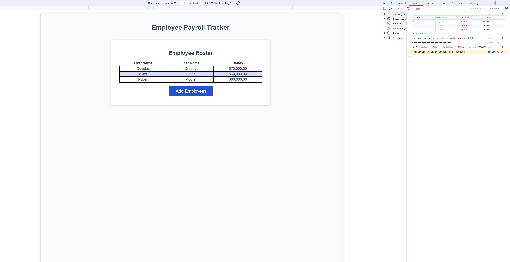

# Payroll-Data-Form

## Description
https://github.com/KylerG12/Payroll-Data-Form

This app demonstrates a way to log and display employee names, salary, and total average salary.

## Installation

N/A

## Usage

This can be used to index a set of employees for payroll purposes.

## Credits

N/A

## License

Please refer to the License in the repo.